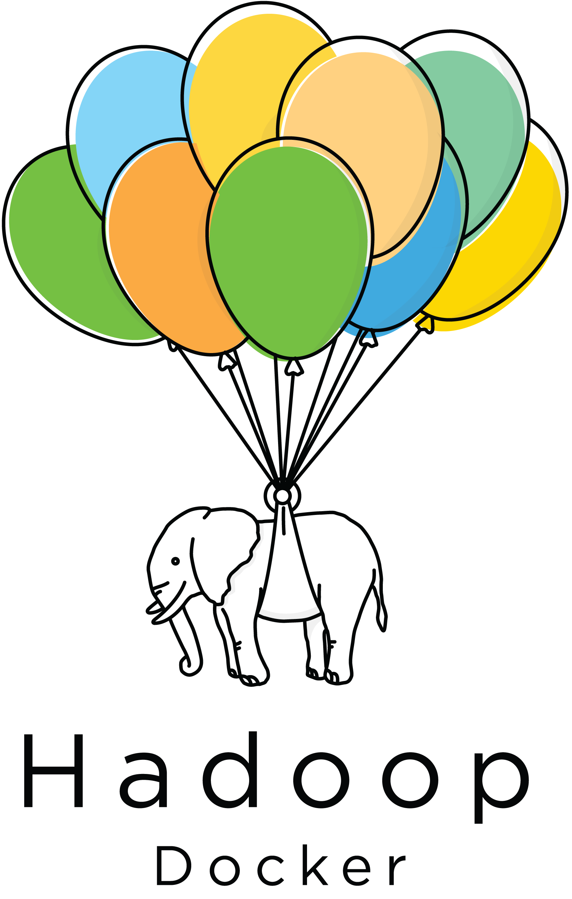

# Floating Elephants

[Docker](https://www.docker.com/) containers for [Hadoop](https://hadoop.apache.org/).

<p align="center">

</p>

An easy way to reproduce a multi-node Hadoop cluster on a local machine.

## Requirements

- A [docker](http://docs.docker.com/) daemon, with at least 4 GB of RAM
- [docker-compose](http://docs.docker.com/compose/install/)

## Getting Started

Pick one of the available Hadoop distributions. For example,

```
cd cloudera/cdh5
```

Build the images for the distribution:

```
docker-compose build
```

Create a Docker network:

```
docker network create -d bridge \
  --subnet=172.20.0.0/16 --gateway 172.20.0.1 --ip-range=172.20.0.0/16 \
  cdh5-lagoon
```

Start the containers:

```
docker-compose up -d --no-recreate
```


## Networking

Hadoop services typically use [DNS](https://wiki.apache.org/hadoop/UnknownHost) to connect to each other. Docker's inbuilt [networking features](https://docs.docker.com/compose/networking/) are set up for the services to talk to each other. For example, to create the `hdp2-lagoon` network run

```
docker network create -d bridge \
  --subnet=172.21.0.0/16 --gateway 172.21.0.1 --ip-range=172.21.0.0/16 \
  hdp2-lagoon
```

We could use `docker-compose` to create networks automatically in the future. Currently the tool will generate domain names with an underscore character, which form invalid URIs.

The hostnames are pre-configured in the Hadoop XML configuration files in `conf.docker_cluster/*.xml` and `docker-compose.yml`. All of these hostnames end with `.cd5-lagoon` or `.hdp2-lagoon`.

Another small container running `dnsmasq` that forwards port 53 acts as the DNS for the host.

To connect to the containers from the host machine using these hostnames, you must add DNS and routing table entries to your host.


### OS X

We use the [resolver(5)](https://developer.apple.com/library/mac/documentation/Darwin/Reference/ManPages/man5/resolver.5.html) mechanism built into OS X to resolve DNS addresses correctly via the /etc/resolver directory which you may need to create.

The following instructions assume that you are using the cloudera distro. Replace `cdh5-lagoon` with `hdp2-lagoon` if you are using the hortonworks distro.

If you're using [`docker-machine`](https://docs.docker.com/machine/),

```
export DOCKER_HOST_IP=$(docker-machine ip $DOCKER_MACHINE_NAME)

sudo mkdir /etc/resolver
echo "nameserver $DOCKER_HOST_IP" | sudo tee /etc/resolver/cd5_default
sudo route -n add -net 172.20.0.0 $DOCKER_HOST_IP
```

If you're using [`boot2docker`](http://boot2docker.io/):

```
export DOCKER_HOST_IP=$(boot2docker ip)
```

To remove these settings at a later point, run the following:

```
sudo rm /etc/resolver/cd5-lagoon
sudo route -n delete 172.20.0.0
```

## Verify your cluster is running

Visit the Web UIs for the services:

Service | Web UI URL
--------|-----------
HDFS Namenode | http://http://hdfsnamenode.cdh5-lagoon:50070/
YARN Resource Manager | http://yarnresourcemanager.cdh5-lagoon:8088/
MapReduce History Server | http://mapreducehistory.cdh5-lagoon:19888/

## Multiple worker nodes

You can scale the number of "clusternodes", which are nodes that run an HDFS Datanode and a YARN Node Manager. For example, to run 5 clusternodes:

```
docker-compose scale clusternode=5
```

## Supported Hadoop Distributions

Vendor | Distro | Directory
------- | ---------- | --------
Cloudera | CDH 5 | `cloudera/cdh5`
Hortonworks | HDP 2 | `hortonworks/hdp2`

## Roadmap

In no particular order:

* Kerberos
* High Availability
* Hive + HCatalog
* Spark

## Contributing

We welcome pull requests! Borrowing from the [docker project](https://github.com/docker/docker/blob/master/CONTRIBUTING.md#sign-your-work)'s guide:

Your signature certifies that you wrote the patch or otherwise have the right to pass it on as an open-source patch. If you can certify the below (from [http://developercertificate.org](http://developercertificate.org)):

```
Developer Certificate of Origin
Version 1.1

Copyright (C) 2004, 2006 The Linux Foundation and its contributors.
660 York Street, Suite 102,
San Francisco, CA 94110 USA

Everyone is permitted to copy and distribute verbatim copies of this
license document, but changing it is not allowed.

Developer's Certificate of Origin 1.1

By making a contribution to this project, I certify that:

(a) The contribution was created in whole or in part by me and I
    have the right to submit it under the open source license
    indicated in the file; or

(b) The contribution is based upon previous work that, to the best
    of my knowledge, is covered under an appropriate open source
    license and I have the right under that license to submit that
    work with modifications, whether created in whole or in part
    by me, under the same open source license (unless I am
    permitted to submit under a different license), as indicated
    in the file; or

(c) The contribution was provided directly to me by some other
    person who certified (a), (b) or (c) and I have not modified
    it.

(d) I understand and agree that this project and the contribution
    are public and that a record of the contribution (including all
    personal information I submit with it, including my sign-off) is
    maintained indefinitely and may be redistributed consistent with
    this project or the open source license(s) involved.
```
Then you just add a line to every git commit message:

```
Signed-off-by: Joe Smith <joe.smith@email.com>
```

If you set your `user.name` and `user.email` git configs, you can sign your commit automatically with `git commit -s`.


## People

* Seshadri Mahalingam, primary contributor
* Jeremy Mailen, architectural & ideological support
* Alexander Vaughn, the awesome project logo
* Vihang Mehta, various contributions
* Many more Trifactans who tried it out and contributed feedback & moral support

<p align="center">
<a href="http://www.trifacta.com">
<br />
</a>
</p>
